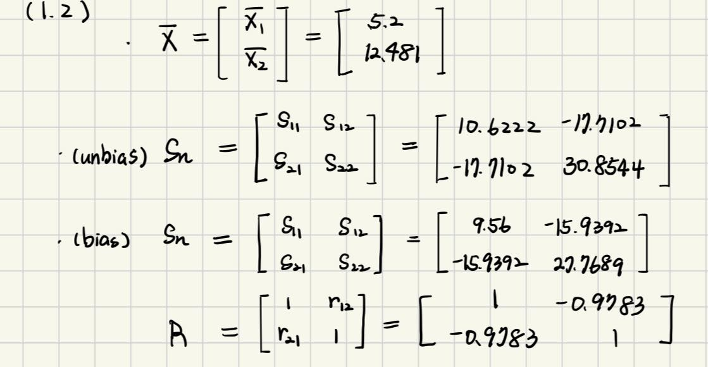
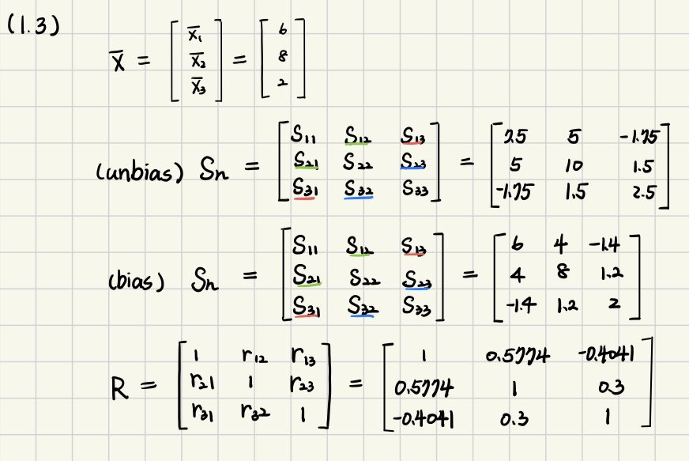
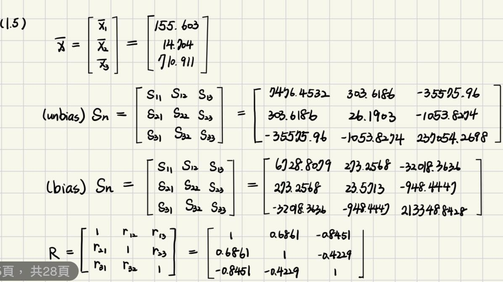

```{r, include = FALSE}
knitr::opts_chunk$set(
  collapse = TRUE,
  comment = "#>"
)
```

```{r setup}
library(MATH4793CHUAssignment)
```
# Question 1 (1.1)
```{r}
x1 <- c(3, 4, 2, 6, 8, 2 ,5)
x2 <- c(5, 5.5, 4, 7, 10, 5, 7.5)

paste("the sample mean of x1 is:", round(mean(x1), 4) )
paste("the sample mean of x2 is:", round(mean(x2), 4) )
paste("the sample variance for x1 (s11) is:", round(var(x1), 4))
paste("the sample variance for x2 (s22) is:", round(var(x2), 4))
unbias_cov <- cov(x1,x2)
paste("the unbias covariance s12 is:", round(unbias_cov, 4) )
bias_cov<- cov(x2,x1)*(length(x1)-1) / length(x1)
paste("the bias covariance s12 is:", round(bias_cov, 4) )
```

# Question 2 (1.2)
```{r, fig.width=7, fig.height=6}
# data
age <- c(1, 2, 3, 3, 4, 5, 6, 8, 9, 11)
price <- c(18.95, 19.00, 17.95, 15.54, 14.00, 12.95, 8.94, 7.49, 6.00, 3.99)
data <- data.frame(Age = age, Price = price)

layout(matrix(c(0, 2, 3, 1), 2, 2, byrow = TRUE), widths = c(1, 4), heights = c(1, 4))
# 1. scatter plot
par(mar = c(5, 4, 2, 2))
plot(data$Age, data$Price, main = "Price vs Age",
     xlab = "Age (Years)", ylab = "Price (Thousands of dollars)", pch = 19)
# 2. Age Marginal dot diagram
par(mar = c(2, 4, 2, 2) )
unique_ages <- unique(data$Age)
counts <- table(data$Age)
plot(unique_ages, counts,  xlim = c(0, max(unique_ages)), ylim = c(0, max(counts)),
      ylab = "count", xlab = "", 
     main = "Age")
# 3. Price Marginal dot diagram
par(mar = c(5, 2, 2, 2))
unique_price <- unique(data$Price)
plot(rep(1.0, length(data$Price)) , data$Price, 
     ylim = c(min(data$Price), max(data$Price)), xlim = c(0,2),
      ylab = "", xlab = "count", main = "Price")
```

According to the plot, two variables, age and price have the negative relationship. This indicates that the sample covariance is negative.

```{r}
paste("the sample mean for age (x1) is:", mean(age))
paste("the sample mean for price (x2) is:", mean(price))
paste("the sample variance for age (s11) is:", round(var(age),4) )
bias_age <- var(age)*(length(age)-1)/length(age)
paste("the sample bias variance for age (s11) is:", round(bias_age,4) )
paste("the sample variance for price (s22) is:", round(var(price), 4) ) 
bias_price <- var(price)*(length(price)-1)/length(price)
paste("the sample bias variance for price (s22) is:", round(bias_price, 4) ) 
paste("the sample unbais covariance (s12) is:", round(cov(age, price), 4) )
biasap <- cov(age, price)*(length(price)-1)/length(price)
paste("the sample bais covariance (s12) is:", round(biasap, 4) )
paste("the sample correlation coefficient (r12) is:", round(cor(age, price), 4) )
```
According to the covariance and the correlation coefficient, those negative sign indicates the negative relation between age and price. Furthermore, the correlation coefficient is -0.9783, close to -1, meaning this is a strong linear negative relationship. Thus, this means an increase in age would cause the price decrease quite consistently.

{ width=60% }

# Question 3 (1.3)
```{r}
x1 <- c(9, 2, 6, 5, 8)
x2 <- c(12, 8, 6, 4, 10)
x3 <- c(3, 4, 0, 2, 1)
c(mean(x1), mean(x2), mean(x3)) #mean
c(var(x1), var(x2), var(x3)) #unbias variance
c(cov(x1, x2), cov(x2, x3), cov(x1, x3)) #unbias covariance
c(var(x1), var(x2), var(x3)) * (length(x1)-1) / length(x1) #bias variance
c(cov(x1, x2), cov(x2, x3), cov(x1, x3)) * (length(x1)-1) / length(x1) #bias variance
c(cor(x1, x2), cor(x2, x3), cor(x1, x3)) #correlation coefficient 
```
{ width=60% }

# Question 4 (1.4)
```{r fig.width=7, fig.height=6}
# data
sales<- c(108.28, 152.36, 95.04, 65.45, 62.97, 263.99, 265.19, 285.06, 92.01, 165.68) #x1, sales in billions
profits <- c(17.05, 16.59, 10.91, 14.14, 9.52, 25.33, 18.54, 15.73, 8.10, 11.13) #x2, profits in billions

layout(matrix(c(0, 2, 3, 1), 2, 2, byrow = TRUE), widths = c(1, 4), heights = c(1, 4))
# 1. scatter plot for x1 and x2
par(mar = c(5, 4, 2, 2))
plot(sales, profits, main="Profit vs Sales", 
     xlab="Sales (billions)", ylab="Profits (billions)", pch=19)
# 2. Sales Marginal dot diagram
par(mar = c(2, 4, 2, 2) )
plot( sales, rep(1,length(sales)), 
      xlim = c(min(sales), max(sales)),ylim = c(0,2), main = "Sales",
      ylab = "count", xlab = "")
# 3. Profit Marginal dot diagram
par(mar = c(5, 2, 2, 2))
plot(rep(1, length(profits)) , profits, 
     ylim = c(min(profits), max(profits)), xlim = c(0,2), main = "Profits",
     ylab = "", xlab = "count")
```
The diagram does not show the perfect linear relationship, but it appears to be a positive relationship between sales and profits.

```{r}
paste("the sales mean is:", round(mean(sales), 4) )
paste("the profits mean is:", round(mean(profits), 4) )
paste("the sales variance is:", round(var(sales), 4))
paste("the profits variance is:", round(var(profits), 4))
paste("the unbias covariance between sales and profits is:", round(cov(sales, profits), 4) )
paste("the correlation coefficient between sales and profits is:", round(cor(sales, profits), 4) )
```
The correlation coefficient between sales and profits is 0.6861, which indicates that it is a positive relationship. However, it is not a strong linear relationship as the absolution is not close to 1.

# Question 5 (1.5)
```{r fig.width=7, fig.height=6}
# data
assets <- c(1484.10, 750.33, 766.42, 1110.46, 1031.29, 195.26, 193.83, 191.11, 1175.16, 211.15) #x3, assets in billions

layout(matrix(c(0, 2, 3, 1), 2, 2, byrow = TRUE), widths = c(1, 4), heights = c(1, 4))
# 1. scatter plot for x1 and x3
par(mar = c(5, 4, 2, 2))
plot(sales, assets, main="Assets vs Sales", 
     xlab="Sales (billions)", ylab="Assets (billions)", pch=19)
# 2. Sales Marginal dot diagram
par(mar = c(2, 4, 2, 2) )
plot( sales, rep(1,length(sales)), 
      xlim = c(min(sales), max(sales)), ylim=c(0,2), main = "Sales",
      ylab = "count", xlab = "")
# 3. Assets Marginal dot diagram
par(mar = c(5, 2, 2, 2))
plot(rep(1, length(assets)) , assets, 
     ylim = c(min(assets), max(assets)),xlim = c(0,2), main = "Assets",
     ylab = "", xlab = "count")
```
The diagram does not show the perfect linear relationship, but it appears to be a negative relationship between sales and assets.

```{r fig.width=7, fig.height=6}
# scatter plot for x2 and x3
layout(matrix(c(0, 2, 3,1), 2, 2, byrow = TRUE), widths = c(1, 4), heights = c(1, 4))
par(mar = c(5, 4, 2, 2))
plot(profits, assets, main="Assets vs Profits", 
     xlab="Profits (billions)", ylab="Assets (billions)", pch=19)
# Profit Marginal dot diagram
par(mar = c(2, 4, 2, 2) )
plot( profits, rep(1,length(profits)), 
      xlim = c(min(profits), max(profits)), ylim = c(0,2), main = "profits",
      ylab = "count", xlab = "")
# Assets Marginal dot diagram
par(mar = c(5, 2, 2, 2))
plot(rep(1, length(assets)) , assets, 
     ylim = c(min(assets), max(assets)), xlim = c(0, 2),  main = "Assets",
      ylab = "", xlab = "count")
```
The diagram does not show the perfect linear relationship, but it appears to be a negative relationship between assets and profits.

```{r}
c(mean(sales), mean(profits), mean(assets)) #mean
round(c(var(sales), var(profits), var(assets)), 4)  # unbias variance
round(c(cov(sales, profits), cov(sales, assets), cov(profits, assets)), 4) # unbias covariance
round(c(var(sales), var(profits), var(assets))*(length(sales)-1)/length(sales), 4)  # bias variance
round(c(cov(sales, profits), cov(sales, assets), cov(profits, assets))*(length(sales)-1)/length(sales), 4) # bias covariance
round(c(cor(sales, profits), cor(sales, assets), cor(profits, assets)), 4) #correlation coef
```
{ width=60% }

# Question 6 (1.6)
```{r}
marginal_dotplot<- function(data) {
  numVariables <- ncol(data)
  for (i in 1:numVariables) {
    # let the value of the variable on x-axis
    x_values <- data[, i]
    # count the number of identical measurement
    counts <- table(x_values)
    # sequence for y-axis
    plot_y <- unlist(lapply(counts, function(cnt) seq_len(cnt)))
    # repeated x-values corresponding to counts
    plot_x <- rep(as.numeric(names(counts)), times=counts)
    # marginal dot plot
    plot(plot_x, plot_y, 
         ylim = c(0, max(plot_y) + 1), 
         xlim = c(min(as.numeric(names(counts))) - 1, max(as.numeric(names(counts))) + 1),
         xlab = names(data)[i], ylab = "Count", main = paste("Variable", i),
         pch = 19, xaxt = 'n')
    # Add x-axis labels
    axis(1, at = unique(plot_x), labels = unique(as.numeric(names(counts))))
  }
}
marginal_dotplot(T1_5)
```
```{r}
# mean array
for (i in 1:7) {
    x<- T1_5[, i]
    print(mean(x))
}
```

```{r}
# variance-covariance array
covMatrix <- function(x) {
  # Number of columns
  p <- ncol(x)
  # Initialize an empty matrix to fill out with covariance values
  covMatrix <- matrix(0, nrow = p, ncol = p)
  # to calculate the covariance of the data
  for (i in 1:p) {
    for (j in 1:p) {
      covMatrix[i, j] <- cov(x[, i], x[, j])
      covMatrix[j, i] <- cov(x[, i], x[, j])
    }
  }
  return(covMatrix)
}
round( covMatrix(T1_5), 4)
```
```{r}
# variance-covariance array
covMatrix <- function(x) {
  # Number of columns
  p <- ncol(x)
  # Initialize an empty matrix to fill out with correlation coefficient
  covMatrix <- matrix(0, nrow = p, ncol = p)
  # to calculate the correlation coefficient of the data
  for (i in 1:p) {
    for (j in 1:p) {
      covMatrix[i, j] <- cor(x[, i], x[, j])
      covMatrix[j, i] <- cor(x[, i], x[, j])
    }
  }
  return(covMatrix)
}
round( covMatrix(T1_5), 4)
```

